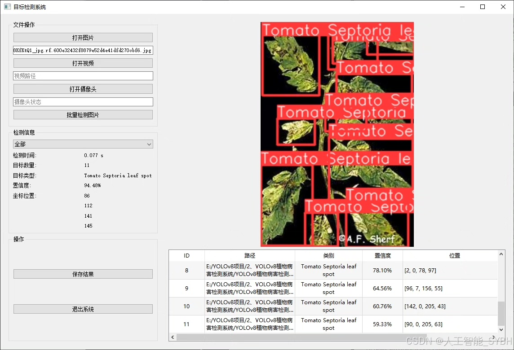
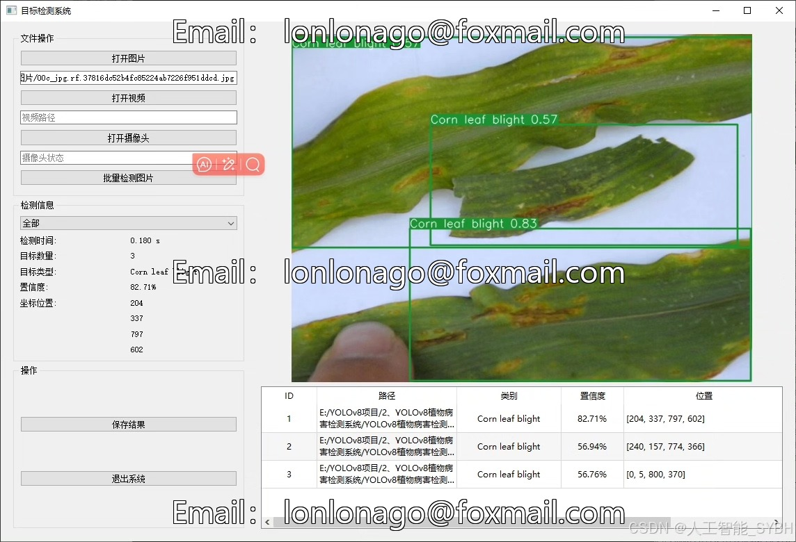
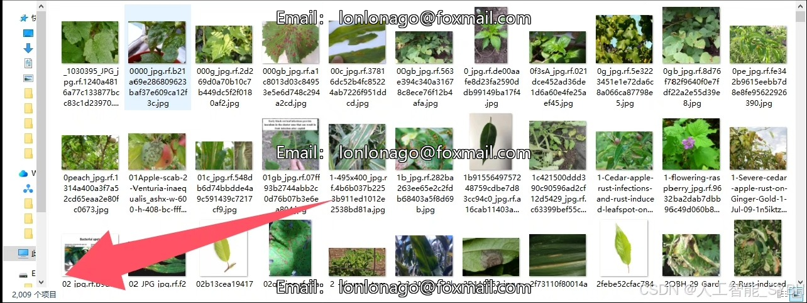
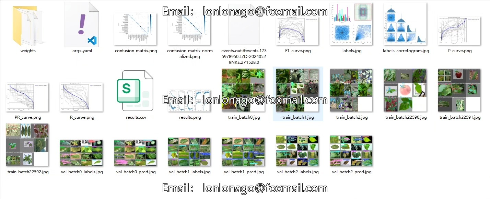
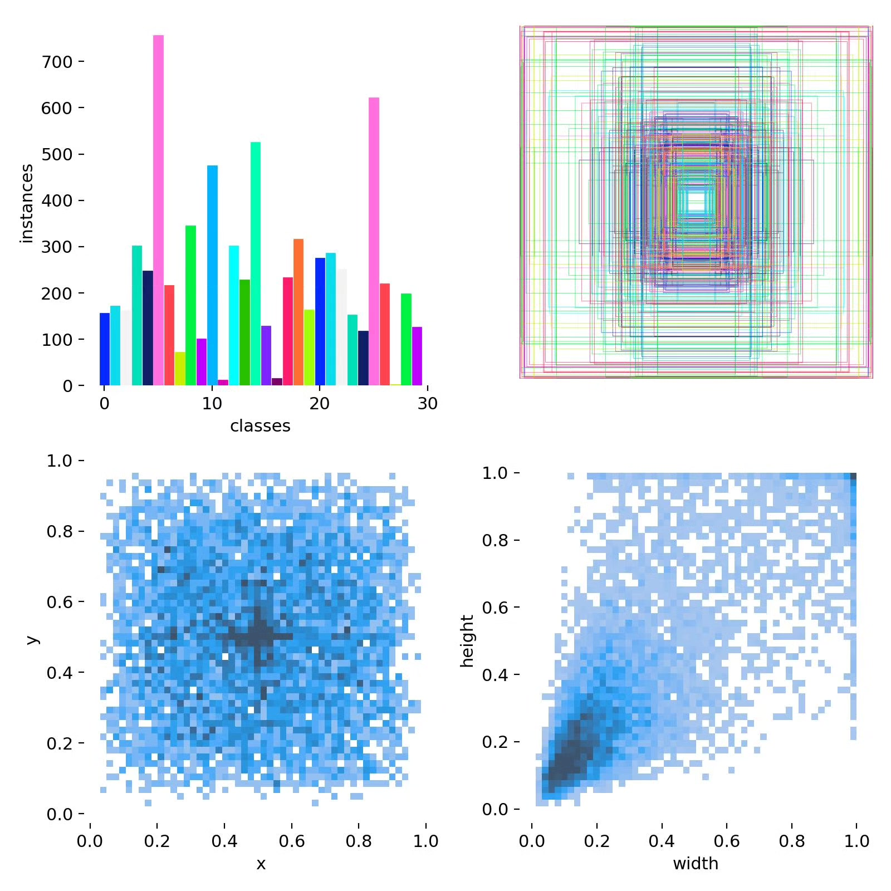
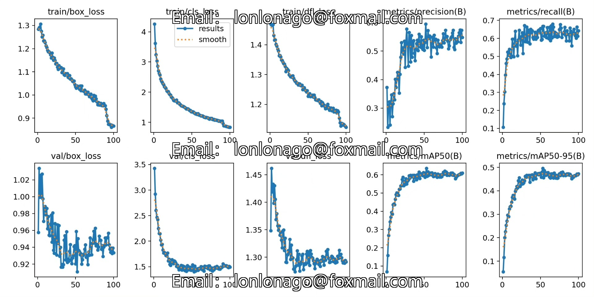
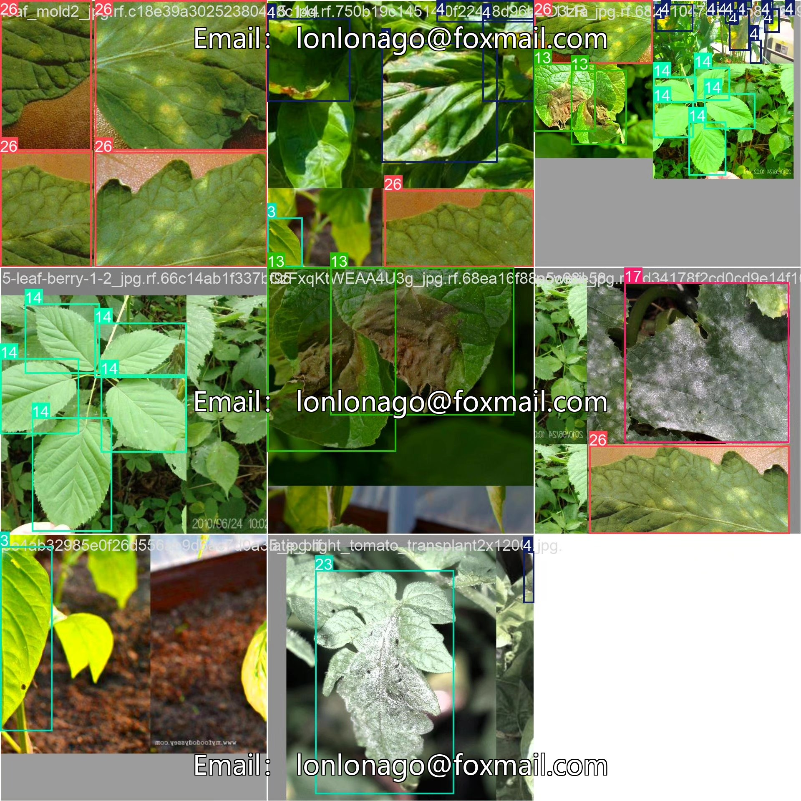
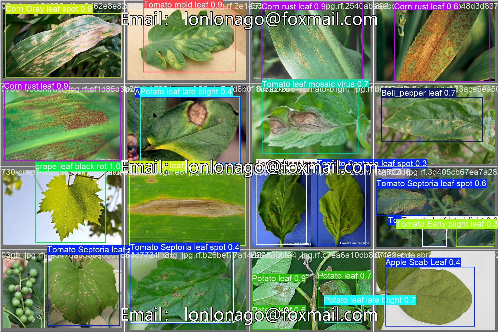

# Visualization Plant Disease Detection System Based on YOLOv8 Deep Learning

## Body

Based on the YOLOv8 deep learning, a visual plant disease detection system (YOLOv8+YOLO dataset + UI interface + Python project source code + model)

Number of images:
Training set: 2009 images
Validation set: 246 images

This project has developed a visual plant disease intelligent detection system based on the YOLOv8 object detection algorithm, specifically for recognizing and classifying 30 different types of plant leaf diseases. The training dataset includes 2009 training images and 246 validation images, covering the health status and disease manifestations of leaves in common economic crops such as apples, blueberries, cherries, corn, peaches, potatoes, soybeans, strawberries, tomatoes, grapes, etc. The system can detect disease characteristics in plant leaf images in real-time, accurately identify specific disease types, and provide rapid and accurate tools for plant health diagnosis for farmers, gardeners, and agricultural researchers. It helps users take timely preventive measures to reduce crop losses.

The company's products have obtained the official commercial license certification from YOLO.

Package after-sales service:

After payment, we will provide WeChat ID for any questions, anytime.

Environment configuration: A tutorial on environment configuration will be provided, with WeChat answering questions.

Remote installation service: If you need remote configuration, an additional fee of 69 is required,
If the configuration fails, all fees are refunded (only the installation fee for special old computers)

Retraining dataset: After setting up the environment, you can train on your own computer.
If you need us to retrain, just pay 69 + computing power fees (2.5 yuan/hour)

Full package after-sales service

## Images

## Payment

Here is a pay link on Stripe ( https://buy.stripe.com/3cs8yP7sY87d0vu9AB ). Please contact me lonlonago@foxmail.com after funding $89, and I will send you a complete data files , thank you!

